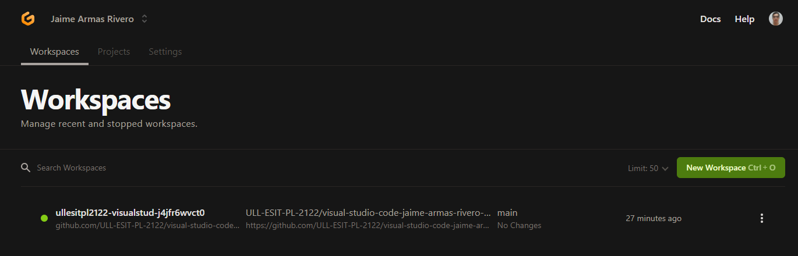
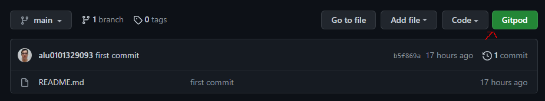
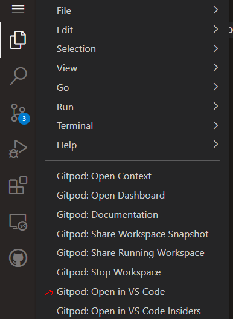
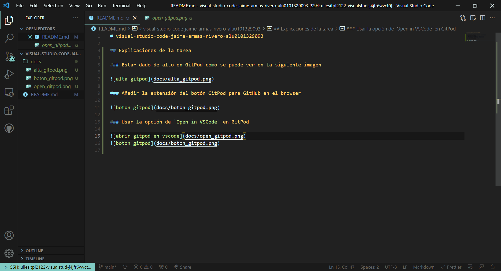
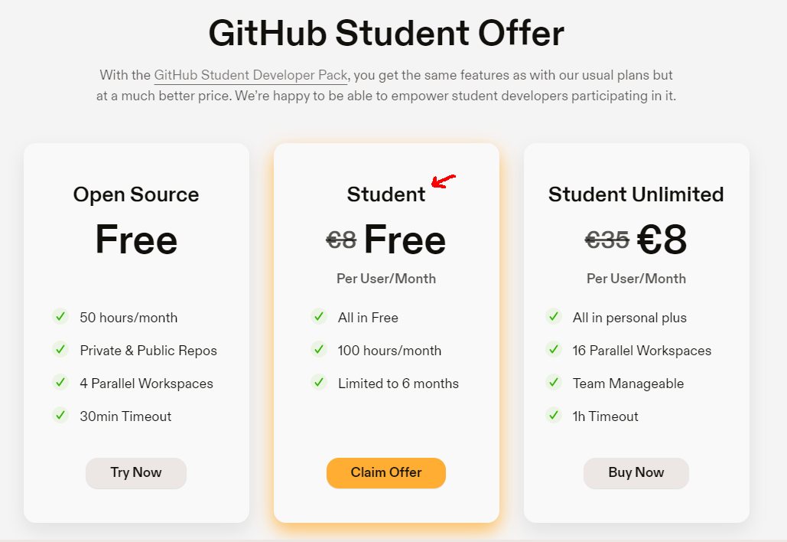
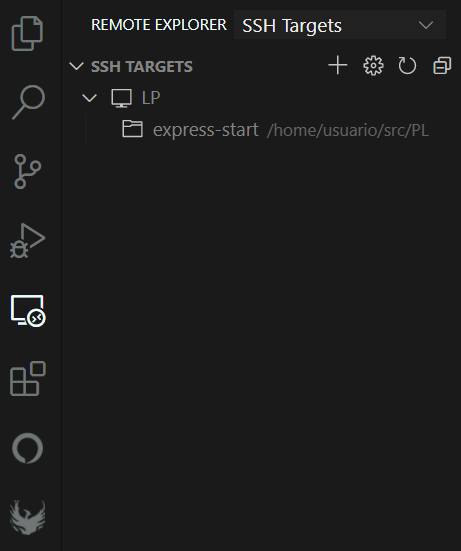
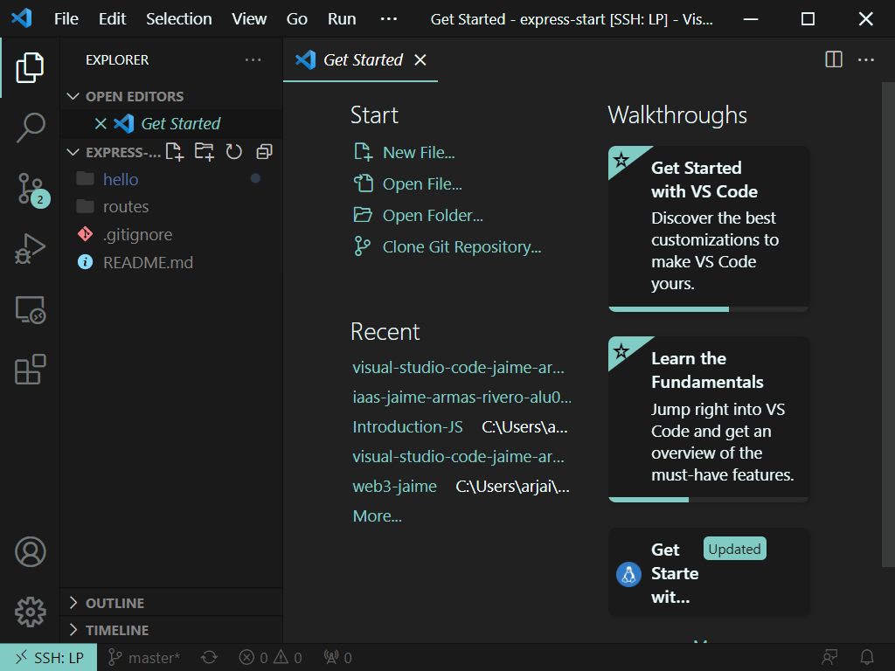
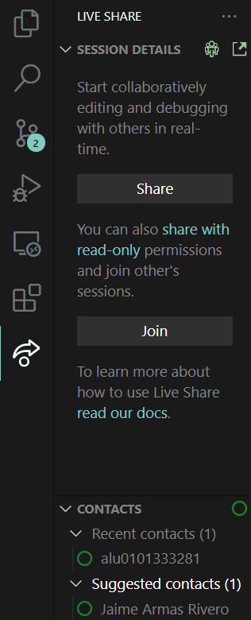

# visual-studio-code-jaime-armas-rivero-alu0101329093

## Explicaciones de la tarea

### Estar dado de alto en GitPod como se puede ver en la siguiente imagen

### Añadir la extensión del botón GitPod para GitHub en el browser

### Usar la opción de `Open in VSCode` en GitPod

- Tras esto se nos abrirá una nueva ventana de VSCode con la carpeta de trabajo del mismo gitpod
  

### Acogerse a la oferta de estudiantes de GitPod

- Por ahora no la tengo porque falta que me confirmen el github backpack

### Tener la extensión de vscode de SSH para poder conectarse a la máquina directamente desde este

- Como se puede ver en este caso, lo tengo configurado para abrir la máquina virtual de `LP` y por ejemplo si abrimos la carpeta `express-start` de la máquina esta se abriría y se vería abajo a la izquierda que esta conectada a esta
  

### También tener instalada y configurada la extensión de LiveShare que permite trabajar en grupo compartiendo código

